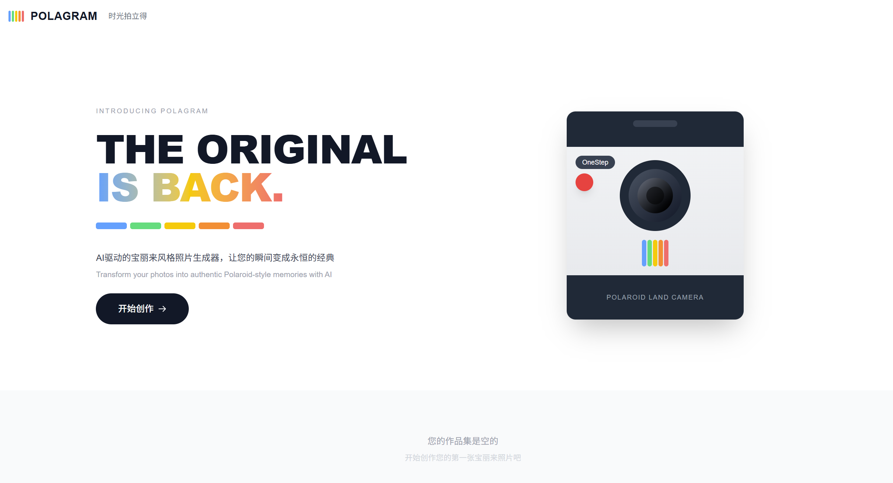

# POLAGRAM - 宝丽来风格照片生成器

AI驱动的在线宝丽来风格照片转换器，让您的瞬间变成永恒的经典。



## 功能特性

- 📸 **照片上传** - 支持拖拽和点击上传（JPG/PNG/WEBP，最大10MB）
- 🎨 **6种相框风格** - 黑色大理石、春日花簇、荧光派对、粉色波点、美式披萨、星空紫色
- ⚡ **实时预览** - 调节复古强度和胶片质感，即时看到效果
- 💾 **本地保存** - 生成历史自动保存到本地作品集
- 📥 **一键下载** - 生成高质量宝丽来照片

## 技术栈

- **框架**: Next.js 16 + React 19 + TypeScript 5
- **状态管理**: Redux Toolkit
- **样式**: Tailwind CSS
- **部署**: 静态导出（Static Export）

## 快速开始

### 安装依赖

```bash
npm install
```

### 开发模式

```bash
npm run dev
```

打开 [http://localhost:3000](http://localhost:3000) 查看结果。

### 构建生产版本

```bash
npm run build
```

构建输出位于 `dist/` 目录。

### 本地预览生产版本

```bash
npx serve@latest dist -l 3000
```

## 项目结构

```
app/
├── components/           # React组件
│   ├── Header.tsx       # 统一顶部栏
│   ├── LandingView.tsx  # 首页
│   ├── UploadView.tsx   # 上传页面
│   ├── PreviewView.tsx  # 预览和调节页面
│   ├── ResultView.tsx   # 结果页面
│   └── gallery/         # 作品集组件
├── store/               # Redux状态管理
│   └── slices/          # 状态切片
├── lib/
│   └── canvasProcessor.ts  # Canvas图片处理
└── page.tsx             # 主页面
```

## 相框风格

| 风格 | 描述 |
|------|------|
| 黑色大理石 | 经典深灰渐变 |
| 春日花簇 | 粉绿渐变，清新花卉 |
| 荧光派对 | 蓝紫粉霓虹渐变 |
| 粉色波点 | 柔和粉色 |
| 美式披萨 | 暖黄橙渐变 |
| 星空紫色 | 深紫渐变，星空主题 |

## 部署

本项目支持任何静态托管服务：

- Vercel
- Netlify
- GitHub Pages
- 阿里云 OSS
- 腾讯云 COS

将 `dist/` 目录上传到托管服务即可。

## 浏览器支持

- Chrome 90+
- Firefox 90+
- Safari 14+
- Edge 90+

## 许可证

MIT License
